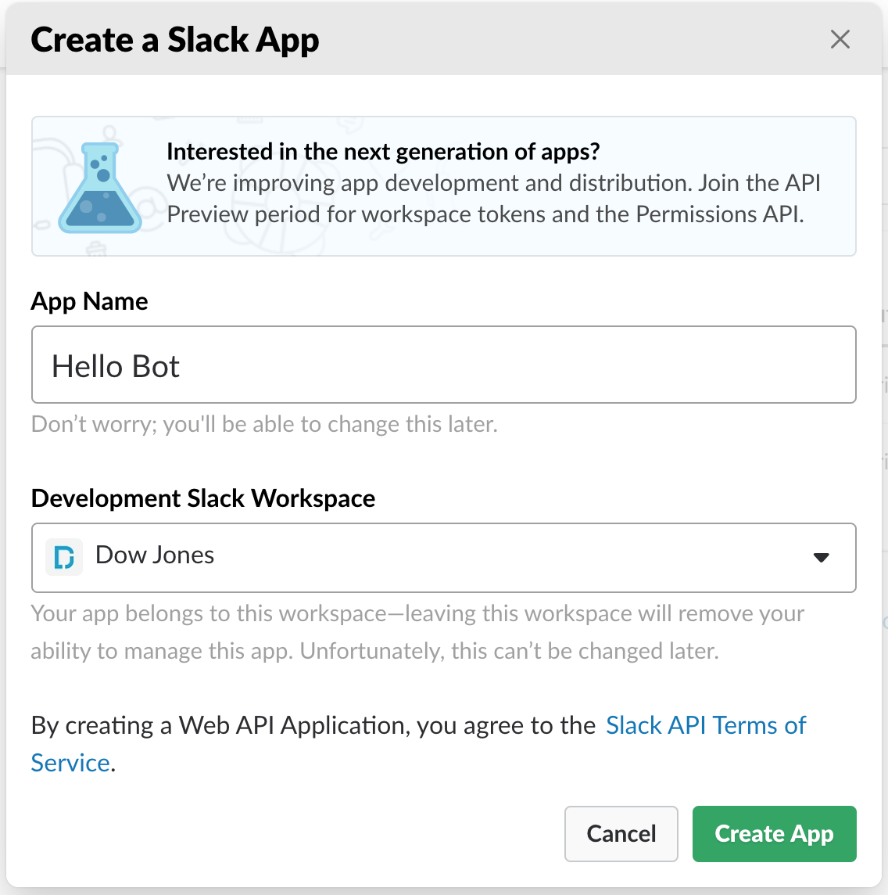

# Getting Started
This documentation has instructions on how to get a very basic bot setup in your local environment. It is by no means complete, but should result in a functioning bot and local development environment.

## Step 1: Install Requirements
Before doing anything else we must clone this repo, and navigate to its parent directory so that we can leverage the boilerplate code that has be written for us.
```
git clone https://github.com/dylanroy/slackbot-template.git
```

For local development efforts a public url will be needed. The easiest way to do this with the least amount of latency would be to use a tool like ngrock or localtunnel. For these instructions, and this template we will be using localtunnel. Use the command below if you have node installed. Specifically this demo we are using the Node Version Manager which will be used throughout this template. This is by no means a requirement for a successfull creation of a development environment.
```
nvm use stable
npm install -g localtunnel
```

Now that we have the ability to expose our bot using a public url we need to install our bot requirements. We will be using Python 2.7 to build this bot, pip to install our requirments, and virtual environment wrapper to control our Python environment using so each of these will need to be installed before moving forward. Once Python 2.7 and the virtual environment wrapper are installed please install this templates requirements as shown below.
```
mkvirtualenv slackbot-template
pip install -r requirements.txt # Flask and requests
```

As more requirements are added to the bot they will be added to the requirements.txt. This template only requires the Flask library for the webserver that will run our bot, and the requests library so that we can make requests to Slack's REST API.

## Step 2: Start Slack Bot
To start our bot locally we simply need to run our bot using the template's run.py file to start Flask. Below to ensure that we are running in the environment we installed our requirements on we activate that environment.
```
workon slackbot-template
python run.py
```

Our bot template has flask running on our local server on port 5000 so this is the port we want to point localtunnel to so below in our script we will be tunneling to that port.
```
lt --port 5000
```

## Step 3: Bot Creation
Now we need to create our bot on the Slack Platform. We do this by navigating to https://api.slack.com/ and clicking the Start Building Button. We are then prompted to input an App Name that can be changed later, and what Slack organization we want to start our development in.  


Following the creation of the bot we then want to add slash command functionality to this bot. This allows users to interact with our bot via a predefined slash command. We do this by navigating to the Slash Commands link under Features. After which we will click the Create New Command button. Once we are prompted to enter information for this commandwe will be using the slash command /hello. The next field is where our localtunnel url comes into play. For the Request URL provide that url in that field. After which provide a Short Description and Usage Hint before submitting the new slash command.


## Step 4: Install Slack Bot
Navigate to OAuth & Permissions under the Features navigation menu, and click on the Install App to Workspace button. Navigate to Slack, and test out the command by typing /hello. 


## Step 5: Setup Permissions & Scopes
This template has multiple options for different commands that use additional functionality and message formatting features. Just switch out the `Request URL` in the user interface to test these out.